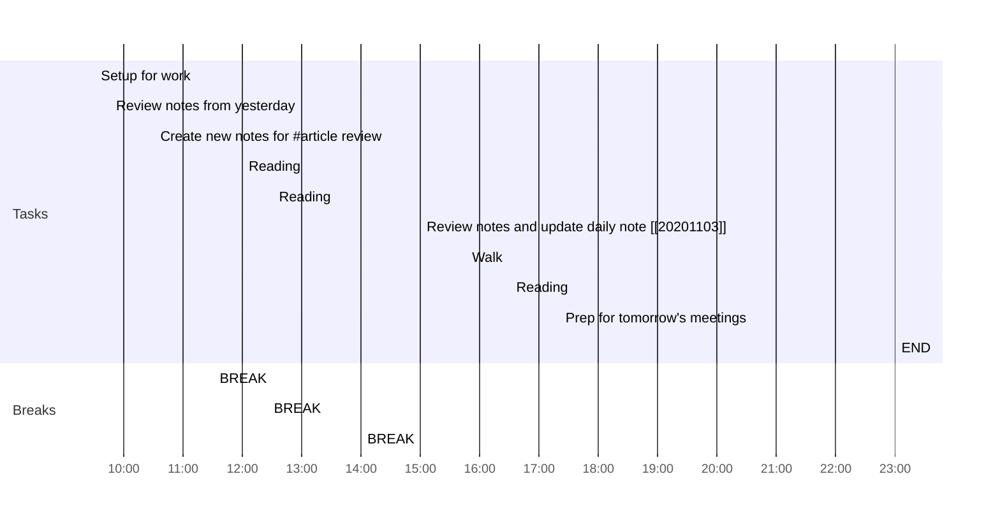

## Day Planner

### 모닝 루틴

- [ ] 05:00 기상
- [ ] 05:30 스트레칭
- [ ] 05:40 샤워
- [ ] 05:50 기사 읽기
- [ ] 06:20 출근
- [ ] 06:30 BREAK

### Reading

A section of the day dedicated to reading:
읽기 대상의 시간은 5~10분 사이의 기사 또는 읽을 거리
1. Articles.
2. Book chapters assigned for the day.
3. Re-reading past notes.
   
- [ ] 05:50 Reading
  - [ ] Article - 경제
  - [ ] Study - English
- [ ] 06:10 BREAK
- [ ] 09:00 Reading
	- [ ] Study - 개발
	- [ ] 지난 체크리스트 확인 : 
	- [ ] 오늘의 업무 - 할일 목록 생성
	- [ ] 프로젝트 이슈
- [ ] 9:30 BREAK

### 할 일
- [ ] ticket 1
- [ ] ticket 2

### Afternoon Review

- [ ] 16:00 Review: 오늘의 할일
- [ ] 16:30 프로젝트 상태에 반영
- [ ] 16:30 이번주 할일에 반영

### Next day Preview
- [ ] 내일 해야할 일 체크 
- [ ] 22:00 END